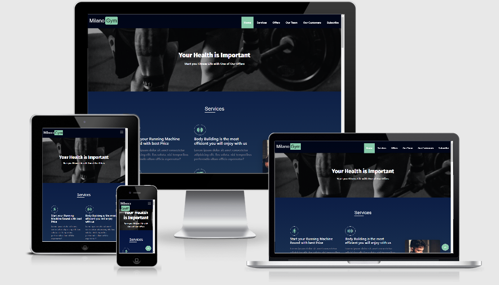

# Milano Gym

One HTML5 Responsive Landing Page Template Project for a Gym. 

  

## Demo
 
  

## Getting Started

You can try the Template from [here](https://milanogym.netlify.app/)

## Prerequisites

Just Modern Browser like "Chrome" and a Code Editor for Deployment and Develop.  

## Built With

* HTML5
* CSS3
* Pure JS version ES2015/ES6  

## Libraries  

* [Font Awesome](https://fontawesome.com/)  
  
## Frameworks 

* [Bootstrap 4](https://getbootstrap.com/)

## Google Fonts  

* [Merriweather](https://fonts.google.com/specimen/Merriweather) 

## Author

* Mohamed Elhawary  

## Contact Me by my Social Accounts

* Email: mohamed.k.elhawary@gmail.com  

* [Linkedin](https://www.linkedin.com/in/mohamed-elhawary14/)

* [Codepen](https://codepen.io/Mohamed-ElHawary)

* [Behance](https://www.behance.net/mohamed-elhawary14)

## Deploy with Me

Feel Free to Deploy it with me, send Issues or a Pull Request and i'll deal with you, just test it First.

## Notices

- This Template is a Practical Landing Page Project from Udacity Nanodegree Program in the Field of Web Development Professional Track.

## License

Licensed under the [MIT License](LICENSE)